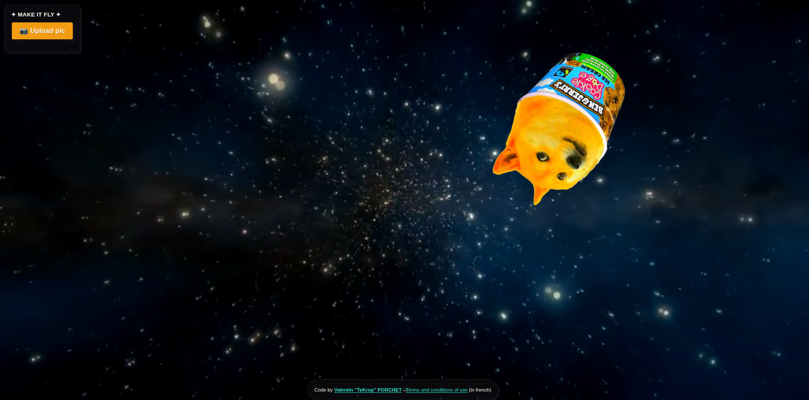

# 🐶 Shooting Stars Meme Generator


[](https://github.com/TeKrop/shooting-stars-meme-generator/actions/workflows/build.yml)

[](https://github.com/TeKrop/shooting-stars-meme-generator/issues)
[](https://github.com/TeKrop/shooting-stars-meme-generator/blob/main/LICENSE)



> Shooting Stars Meme Generator using CSS animations, use your own images and have fun!

## Table of contents
* [✨ Demo](#-demo)
* [🚀 Quick start](#-quick-start)
* [🔧 Configuration](#-configuration)
* [🐋 Docker](#-docker)
* [💽 Manual install](#-manual-install)
* [🤝 Contributing](#-contributing)
* [📝 License](#-license)

## ✨ [Demo](https://shooting-stars.tekrop.fr)

You can see and use a live version of the service here : https://shooting-stars.tekrop.fr/. If you want to use the service, and you have the possibility to host your own instance, please do it (at least for production environment), in order to not overload the live version I'm hosting.

## 🚀 Quick start

Everything runs through Docker via [`just`](https://github.com/casey/just) — no local Bun/Node install needed:

```sh
just up       # build the image, then start it (production mode)
just dev      # ...or run in dev mode instead, with live HMR (bun --hot)
```

Commands you'll use while working on the project:

```sh
just check    # type-check (tsc --noEmit) + lint/format-check (biome)
just format   # auto-fix lint/format issues
just test     # run the test suite (bun:test)
just shell    # open a shell inside the app container
just down     # stop and remove containers
just --list   # see all available commands
```

## 🔧 Configuration

All settings are optional and have sane defaults — copy [`.env.dist`](.env.dist) to `.env` and adjust as needed:

| Variable                | Default                       | Used by               | Description                                                                                        |
| ------------------------ | ------------------------------ | ----------------------- | ----------------------------------------------------------------------------------------------------- |
| `APP_PORT`               | `9595`                         | Docker only            | Host port the app is published on. The app itself always listens on `9595` inside the container.  |
| `HASH_LENGTH`            | `5`                            | App                    | Length of the random hash used in uploaded images' URLs.                                          |
| `UPLOADS_DIR`            | `/tmp/shooting-stars-uploads`  | Docker only            | Host path bind-mounted to the container's uploads directory. **Set this to a real persistent path in production** — the default is an ephemeral, low-surprise placeholder. |
| `UPLOAD_RETENTION_DAYS`  | `30`                           | Docker only (cleanup)  | How many days an uploaded file is kept before the cleanup service deletes it.                      |

`NODE_ENV` is intentionally not configurable via `.env` — it's fixed per Docker build stage (dev vs. prod) in the `Dockerfile`.

## 💽 Manual install

Without Docker, install [Bun](https://bun.com) locally and run the app directly:

```sh
cp .env.dist .env # optional, see Configuration above
bun install
bun server/server.ts
```

## 🤝 Contributing

Contributions, issues and feature requests are welcome!

Feel free to check [issues page](https://github.com/TeKrop/shooting-stars-meme-generator/issues).

Before opening a PR:

**Local checks**
* run `just check` (type-check + lint) and `just test` locally — CI runs the same checks on every PR

**Commit messages**
* follow [Conventional Commits](https://www.conventionalcommits.org/) (`type(scope): subject`, e.g. `fix: correct upload hash length`, `feat: add drag-and-drop upload`) — this drives automated releases, see [CLAUDE.md § Contributing](CLAUDE.md#contributing) for details

## 📝 License

Copyright © 2017-2026 [Valentin PORCHET](https://github.com/TeKrop).

This project is [MIT](https://github.com/TeKrop/shooting-stars-meme-generator/blob/main/LICENSE) licensed.

***
_This README was generated with ❤️ by [readme-md-generator](https://github.com/kefranabg/readme-md-generator)_
